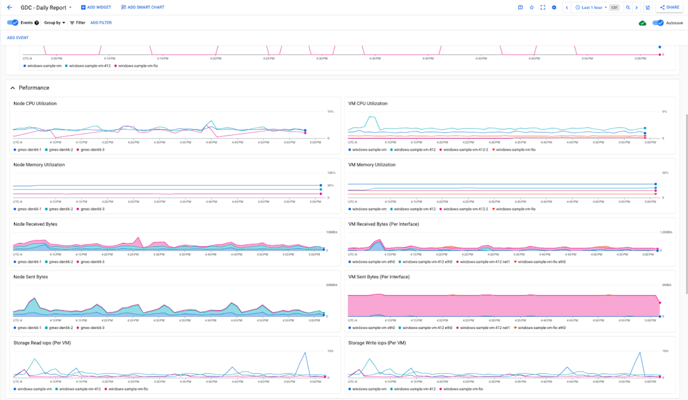
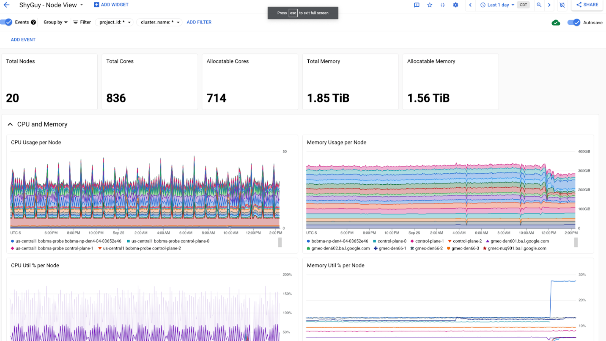
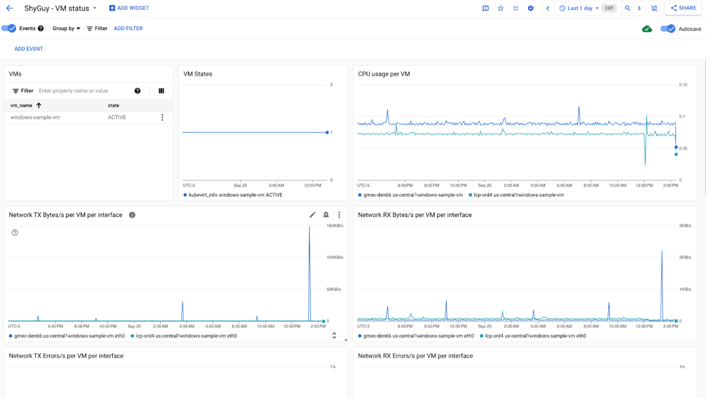
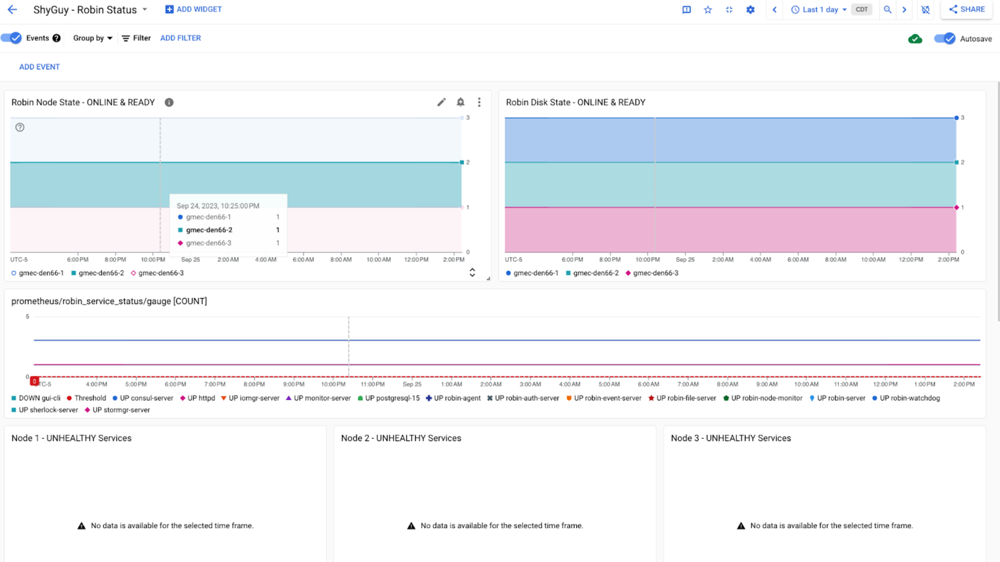
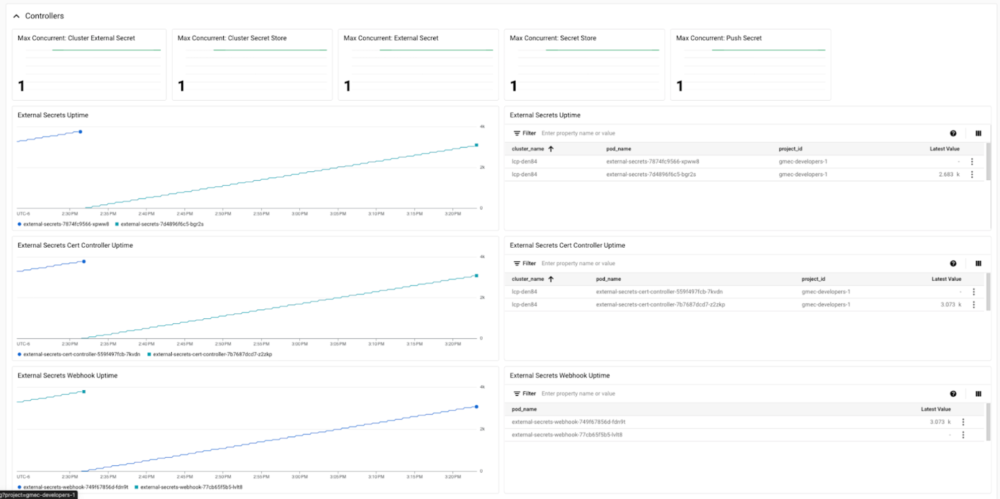
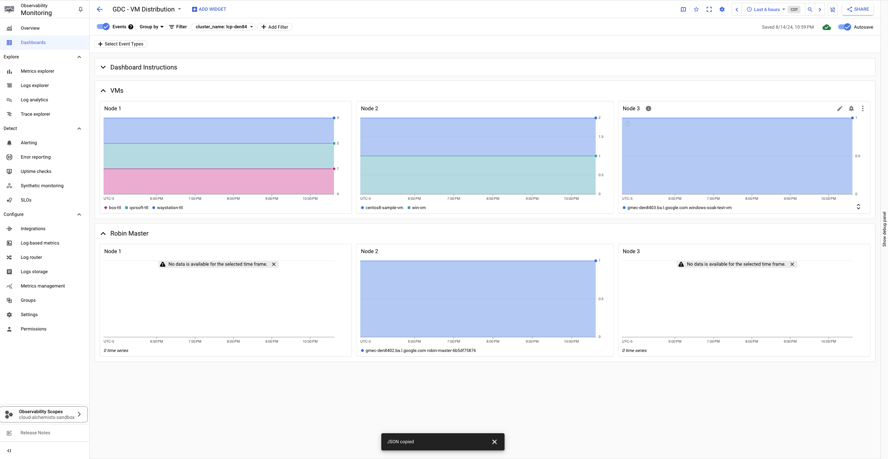

# GDC Connected Servers Enterprise Observability

## Overview

This project contains predefined dashboards and alerts for enterprise workloads running on GDC Connected Servers. 

## Deployment Quickstart

Dashboards and alerts can be deployed through the following methods:

### Option 1 - Scripted deployment

1. `cd alerts`
2. Run `./create-alerts.sh`. This will deploy scripts into your current context's project. Modify script if notification channels are needed.

Dashboards are stored in the dashboards folder and can be manually deployed. 

### Option 2 - Terraform deployment

1. cd terraform
2. cp `backend.tf.sample` to `backend.tf` and modify to store tfstate in target cloud storage bucket.
3. `terraform plan`/`teraform apply`

## Dashboards

| Dashboard Name       | Screenshot                                                          | Description                                                                                                      | json                      |
| :------------------- | :------------------------------------------------------------------ | :--------------------------------------------------------------------------------------------------------------- | :------------------------ |
| GDC Daily Report     |   | Dashboard showing node/VM availability and utilization based metrics                                             | [json](./dashboards/gdc-daily-report.json) |
| GDC Node View        |  | Dashboard showing GDC node information                                                                           | [json](./dashboards/gdc-node-view.json) |
| GDC VM Status        |  | Dashboard showing GDC VM information                                                                             | [json](./dashboards/gdc-vm-view.json) |
| GDC Robin Status     |  | Dashboard to deep-dive into robin metrics. Note: this dashboard requires the use of the robin-health application | [json](./dashboards/gdc-robin-status.json) |
| GDC External Secrets |  | Dashboard showing External Secrets operational information                                                       | [json](./dashboards/gdc-external-secrets.json) |
| GDC VM Distribution  |  | Dashboard showing VM distribution by node                                                       | [json](./dashboards/gdc-vm-distribution.json) |

## Alerts

| Alert | Category | Description | link |
| :----------------------------------- | :-------------- | :---------------------------------------------------------------- | :------------------------ |
| node-cpu-usage-high                  | Node            | Alert when CPU usage of any node exceeds 80%                      | [config](./alerts/node/node-cpu-usage-high.yaml) |
| node-memory-usage-high               | Node            | Alert when memory usage of any node exceeds 80%                   | [config](./alerts/node/node-memory-usage-high.yaml) |
| node-not-ready-30m                   | Node            | Alert if any node is not ready for more than 30 minutes           | [config](./alerts/node/node-not-ready-30m.yaml) |
| multiple-nodes-not-ready-realtime    | Node            | Alert if multiple nodes are not ready at any time                 | [config](./alerts/node/multiple-nodes-not-ready-realtime.yaml) |
| api-server-error-ratio-5-percent     | Control-plane   | Alert if the API server has an error ratio exceeding 5%           | [config](./alerts/control-plane/api-server-error-ratio-5-percent.yaml) |
| apiserver-down                       | Control-plane   | Alert if api server is down                                       | [config](./alerts/control-plane/apiserver-down.yaml) |
| controller-manager-down              | Control-plane   | Alert if controller manager is down                               | [config](./alerts/control-plane/controller-manager-down.yaml) |
| scheduler-down                       | Control-plane   | Alert if scheduler is down                                        | [config](./alerts/control-plane/scheduler-down.yaml) |
| pod-crash-looping                    | Pods            | Alert if a pod is crashlooping                                    | [config](./alerts/pods/pod-crash-looping.yaml) |
| pod-not-ready-1h                     | Pods            | Alert if a pod is not ready for more than an hour                 | [config](./alerts/pods/pod-not-ready-1h.yaml) |
| coredns-down                         | System          | Alert if CoreDNS is down                                          | [config](./alerts/system/coredns-down.yaml) |
| coredns-servfail-ratio-1-percent     | System          | Alert if greater than 1 percent of DNS requests are SERVFAILs     | [config](./alerts/system/coredns-servfail-ratio-1-percent.yaml) |
| robin-master-down-10m                | Storage         | Alert if robin master is down for more than 10 minutes            | [config](./alerts/storage/robin-master-down-10m.yaml) |
| robin-node-offline-30m               | Storage         | Alert if a robin node is offline for more than 30 minutes         | [config](./alerts/storage/robin-node-offline-30m.json) |
| robin-disk-inactive-10m              | Storage         | Alert if robin disk is inactive for more than 10 minutes          | [config](./alerts/storage/robin-disk-inactive-10m.yaml) |
| vmruntime-heartbeats-active-realtime | VMRuntime       | Alert if VMRuntime heartbeats are missing                         | [config](./alerts/vm-workload/vmruntime-heartbeats-active-realtime.yaml) |
| vmruntime-heartbeats-realtime        | VMRuntime       | Alert if VMRuntime heartbeats are 0                               | [config](./alerts/vm-workload/vmruntime-heartbeats-realtime.yaml) |
| vmruntime-vm-down-5m                 | VMRuntime       | Alert if any VM is not active for more than 5 minutes             | [config](./alerts/vm-workload/vmruntime-vm-down-5m.yaml) |
| vmruntime-vm-missing-5m              | VMRuntime       | Alert if CPU activity for a VM are absent for more than 5 minutes | [config](./alerts/vm-workload/vmruntime-vm-missing-5m.yaml) |
| vmruntime-vm-no-network-traffic-5m   | VMRuntime       | Alert if there is no network activity from a VM                   | [config](./alerts/vm-workload/vmruntime-vm-no-network-traffic-5m.yaml) |
| externalsecrets-down-30m             | ExternalSecrets | Alert if External Secrets is down                                 | [config](./alerts/system/externalsecrets-down-30m.yaml) |
| externalsecrets-sync-error           | ExternalSecrets | Alert if any ExternalSecret resources have sync errors            | [config](./alerts/system/externalsecrets-sync-error.yaml) |

## Disclaimer

This project is not an official Google project. It is not supported by
Google and Google specifically disclaims all warranties as to its quality,
merchantability, or fitness for a particular purpose.